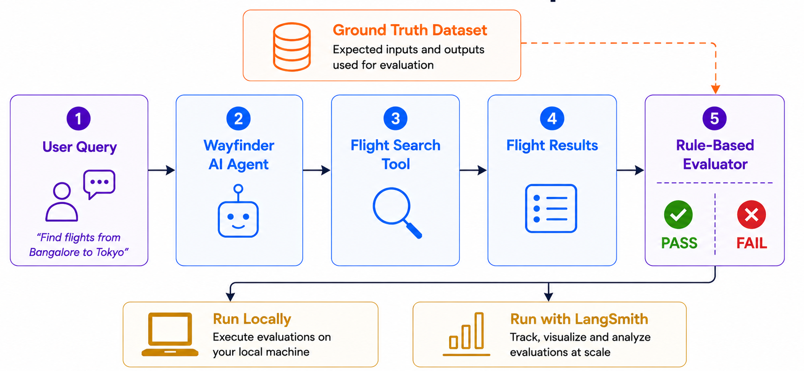

# Wayfinder

Wayfinder is a reference implementation for exploring, learning, and teaching AI Engineering through a realistic AI travel assistant.

It evolves alongside the **AI Engineering Fundamentals** article series, with each milestone introducing one new AI Engineering concept and its implementation.

---

## Why Wayfinder?

Many AI tutorials begin by introducing frameworks.

Wayfinder starts with engineering principles and introduces frameworks only when they solve a real problem.

Instead of introducing every AI framework at once, the project evolves incrementally—building one concept at a time while keeping the codebase runnable and easy to understand.

---

## What You'll Build

Throughout this series, you'll build:

- A realistic AI travel assistant
- An AI evaluation framework
- Rule-based evaluators
- Human evaluation workflows
- LLM-as-a-Judge evaluators
- Production-ready AI evaluation pipelines
- LangSmith integrations

---

## Engineering Principles

Wayfinder follows a few simple principles:

- Teach concepts before frameworks.
- Introduce technologies only when they solve a real problem.
- Build one concept at a time.
- Keep the architecture framework-neutral.
- Prefer readability over cleverness.
- Earn abstractions instead of designing them upfront.
- End every milestone with a runnable example.

---

## Current Milestone

### ✅ Milestone 2 — Rule-Based Evaluation

The following diagram shows the architecture implemented in this milestone.



Current capabilities:

- Flight domain models
- Flight search service
- Search flight tool
- Wayfinder agent
- Runnable examples
- Rule-based evaluator
- Local evaluation pipeline
- LangSmith integration

> **Note**
>
> The current `WayfinderAgent` intentionally uses simple rule-based parsing.
> This keeps the focus on learning AI engineering concepts such as evaluation,
> rather than prompt engineering or LLM orchestration.
>
> As the series progresses, the agent will evolve into a more capable AI-powered implementation while reusing the same evaluation framework.

---

## Project Structure

```text
src/
    wayfinder/
        agent/          # AI agent
        evaluators/     # Evaluation framework
        models/         # Domain models
        services/       # Business services
        tools/          # AI tools

examples/               # Runnable examples

docs/                   # Design documentation
```

---

## LangSmith Setup

The LangSmith evaluation example requires a LangSmith account and an API key.

1. Create a LangSmith account and generate an API key by following the official guide:

   https://docs.langchain.com/langsmith/create-account-api-key

2. Copy the example environment file:

```bash
cp .env.example .env
```

3. Replace the placeholder value in `.env` with your own API key.

The LangSmith evaluation example automatically loads the `.env` file using `python-dotenv`.

> **Note**
>
> The local rule-based evaluation example does **not** require LangSmith or any API keys.
> Only the `langsmith_evaluation.py` example depends on this configuration.

---

## Quick Start

Clone the repository:

```bash
git clone https://github.com/DivakarUngatla/wayfinder.git

cd wayfinder
```

Install dependencies:

```bash
uv sync
```

Run the basic flight search example:

```bash
uv run python examples/basic_flight_search.py
```

Run the local rule-based evaluation:

```bash
uv run python examples/local_evaluation.py
```

Run the LangSmith evaluation:

```bash
uv run python examples/langsmith_evaluation.py
```

---

## Learning Journey

- ✅ Milestone 1 — Basic Flight Search
- ✅ Milestone 2 — Rule-Based Evaluation
- ⏳ Milestone 3 — Human Evaluation
- ⏳ Milestone 4 — LLM-as-a-Judge
- ⏳ Milestone 5 — Building Evaluation Datasets
- ⏳ Milestone 6 — Operationalizing AI Evaluations
- ⏳ Milestone 7 — Comparing Evaluation Experiments

---

## Documentation

- `docs/architecture.md`
- `docs/coding_principles.md`
- `docs/design_decisions.md`

---

## AI Engineering Fundamentals

Wayfinder evolves alongside the **AI Engineering Fundamentals** series.

Each article introduces one new engineering concept, and the repository implements it step by step.

### Articles

- Part 1 — Software Tests vs AI Evals *(link)*
- Part 2 — Understanding AI Evaluation *(link)*
- Part 3 — Rule-Based Evaluation *(link)*

The goal is not to build a production travel platform.

The goal is to demonstrate production AI engineering practices through a realistic application.

---

## Releases

Each GitHub Release corresponds to a milestone in the AI Engineering Fundamentals series.

Checking out a release lets you reproduce the exact code used in that article.

| Milestone | Release |
|-----------|---------|
| Basic Flight Search | `v0.1.0` |
| Rule-Based Evaluation | `v0.2.1` |
| ... | ... |

---

## Contributing

Contributions, bug reports, and suggestions are welcome.

If you spot an issue or have ideas for improving the learning experience, feel free to open an issue or submit a pull request.

---

## License

This project is licensed under the MIT License.